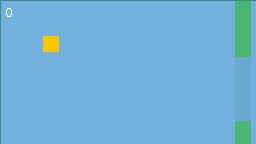

Tested with OpenJDK 17 on Linux x64. Press SPACE or UP ARROW to jump.

NOTE: plain AWT was used instead of Swing for personal experimental
purposes. However, Swing is generally a better choice for most GUI stuff
in Java. This code should not be considered a reference for best
practices (idk what im doing sometimes).

    javac -d out Game.java    # compile
    java -cp out:assets Game  # run (on Windows, replace ':' with ';')
